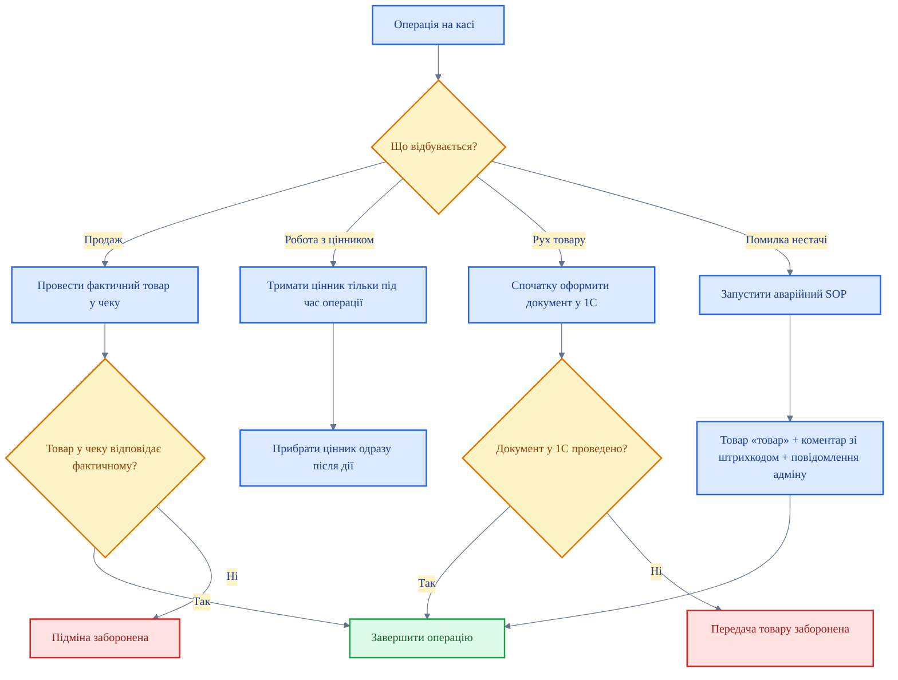

# Касова дисципліна

<DocumentMeta
  type="regulation"
  status="approved"
  owner="Anton"
  review-cycle-days="365"
  effective-from="2026-03-26"
  last-reviewed="2026-03-26"
/>

> [!NOTE]
> У цьому розділі зібрані базові правила касової дисципліни, заборонені дії на касі, порядок роботи з цінниками, контроль руху товару через 1С, вимоги до відповідності товару в чеку та аварійні сценарії під час продажу.

## Навігація по розділу

- <IconLucideShield style="vertical-align: text-bottom; margin-right: 6px;" /> **Базові принципи:** політика касової дисципліни
- <IconLucideBan style="vertical-align: text-bottom; margin-right: 6px;" /> **Заборони:** дії, які спотворюють облік або створюють простір для маніпуляцій
- <IconLucideTags style="vertical-align: text-bottom; margin-right: 6px;" /> **Прикасова зона:** окремий SOP по роботі з цінниками
- <IconLucideBoxes style="vertical-align: text-bottom; margin-right: 6px;" /> **Рух товару:** вибуття товару лише через 1С
- <IconLucideReceiptText style="vertical-align: text-bottom; margin-right: 6px;" /> **Точність чека:** у чеку тільки фактичний товар
- <IconLucideTriangleAlert style="vertical-align: text-bottom; margin-right: 6px;" /> **Аварійний сценарій:** дії при помилці нестачі в 1С

## Блок-схема касової дисципліни

## Документи розділу

### Політики

- [Політика касової дисципліни](/cash/cash-discipline/policy-cash-discipline)

### SOP

- [SOP: Робота з цінниками в прикасовій зоні](/cash/cash-discipline/sop-price-tags-at-cashdesk)
- [SOP: Дії при помилці нестачі товару в 1С](/cash/cash-discipline/sop-stock-shortage-error-during-sale)

### Регламенти

- [Регламент заборонених дій на касі](/cash/cash-discipline/reg-forbidden-actions-at-cashdesk)
- [Регламент руху товару тільки через 1С](/cash/cash-discipline/reg-goods-movement-only-through-1c)
- [Регламент відповідності товару в чеку фактичному товару](/cash/cash-discipline/reg-receipt-item-must-match-actual-goods)
