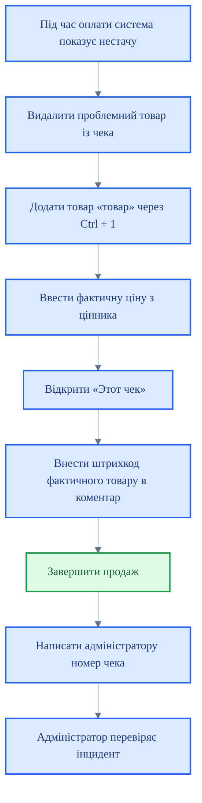

# SOP: Дії при помилці нестачі товару в 1С

<DocumentMeta
  type="sop"
  status="draft"
  owner="Anton"
  review-cycle-days="180"
  effective-from="2026-03-26"
  last-reviewed="2026-03-26"
/>

> [!WARNING]
> Цей документ має статус `draft`. Не є офіційним до підтвердження редактором.

## Коли застосовується

Цей алгоритм застосовується, якщо після створення чека і спроби провести оплату система показує помилку про нестачу товару на складі.

## Основне правило

У такій ситуації працівник не має права довільно підміняти номенклатуру. Потрібно діяти лише за встановленим порядком.

## Блок-схема аварійного сценарію

## Покрокові дії

1. Видалити з чека товар, якого не вистачає на складі.
2. Додати в чек товар «товар», використовуючи поєднання клавіш `Ctrl + 1`.
3. Оскільки це товар з відкритою ціною, вручну ввести ціну в сумі, що дорівнює ціні на ціннику фактичного товару.
4. Натиснути кнопку «Этот чек» у правому нижньому куті.
5. У полі «Комментарий» ввести штрих-код із цінника фактичного товару.
6. Після завершення операції написати адміністратору повідомлення з номером чека.

## Навіщо потрібен цей порядок

Цей порядок потрібен для того, щоб:
- не втратити продаж;
- не допустити хаотичної підміни номенклатури;
- зберегти слід проблеми для подальшого розбору;
- дозволити адміністратору знайти й виправити розбіжність у системі;
- зберегти керованість і прозорість обліку.

## Що заборонено в такій ситуації

Заборонено:
- проводити будь-який інший випадковий товар;
- ігнорувати коментар із штрих-кодом;
- не повідомляти адміністратора;
- приховувати проблему, якщо продаж уже проведено.

<RoleCard title="Роль адміністратора" subtitle="Післяаварійна перевірка">

- Перевіряє інцидент після отримання номера чека.
- Встановлює причину розбіжності.
- Ініціює коригувальні дії в обліку.

</RoleCard>

<DecisionRule title="Управлінський сенс" verdict="Це контрольований аварійний сценарій" tone="warning">
Це не спосіб обійти систему. Це спосіб не зупиняти продаж, не вигадувати ручних рішень і залишати слід для подальшого виправлення.
</DecisionRule>

## Пов'язані документи

<RelatedDocuments />
