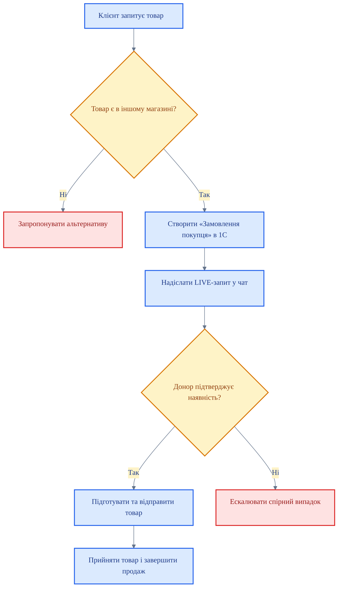

# SOP: LIVE-переміщення між магазинами

<DocumentMeta
  type="sop"
  status="draft"
  owner="Anton"
  review-cycle-days="180"
  effective-from="2026-03-25"
  last-reviewed="2026-03-25"
/>

> [!WARNING]
> Цей документ має статус `draft`. Не є офіційним до підтвердження редактором.

## Мета

Описати покрокове виконання LIVE-переміщення після коректного оформлення запиту.

Дія — Результат:
- Створюємо підставу в 1С — запит стає чинним.
- Перевіряємо наявність і резерв — передача відбувається без помилок.
- Доводимо процес до продажу або повернення — товар не зависає між магазинами.

## Коли застосовується

Документ застосовується, якщо:
- є реальний клієнт;
- створено **«Замовлення покупця»** в 1С;
- товар потрібно терміново перемістити між магазинами.

> [!NOTE]
> Правила пріоритету, відмови, резерву та ескалації визначені в [Регламенті LIVE-переміщення між магазинами](/product/transfers/reg-live-transfer-between-stores).

## Хто відповідальний

| Роль | Відповідає за |
|---|---|
| Магазин-запитувач | Оформлює LIVE-запит, створює «Замовлення покупця» в 1С, вказує клієнта, номенклатуру та строк резерву |
| Магазин-донор | Перевіряє фізичну наявність, виконує передачу товару або надає допустиму підставу для відмови |
| Керуючий / модератор | Розглядає спірні випадки, коли магазини не дійшли згоди |

## Блок-схема процесу



## Основні правила

<EscalationBox title="Критична точка" level="critical">
Якщо магазин-донор не підтверджує наявність, блокує передачу поза регламентом або виникає конфлікт по резерву, процес не зупиняється в чаті — кейс одразу ескалується.
</EscalationBox>

## Покрокові дії

### Крок 1 — Створіть підставу

1. Переконайтеся, що запит подається під реального клієнта.
2. Створіть у 1С **«Замовлення покупця»**.
3. Вкажіть клієнта, номенклатуру та строк резерву.

### Крок 2 — Перевірте товар

1. Перевірте залишок у системі.
2. Підтвердьте фізичну наявність товару.
3. Переконайтеся, що на товар немає активного резерву.

### Крок 3 — Надішліть LIVE-запит

1. Вкажіть товар, кількість, магазин-донор і магазин-одержувач.
2. Додайте номер або підтвердження **«Замовлення покупця»**.
3. Вкажіть строк резерву.

### Крок 4 — Виконайте передачу

1. Магазин-донор підтверджує готовність до відправки.
2. Магазин-донор готує товар до передачі.
3. Магазин-одержувач приймає товар і перевіряє його.

### Крок 5 — Закрийте процес

1. Якщо клієнт купив товар — закрийте продаж.
2. Якщо продажу немає в межах строку резерву — поверніть товар магазину-донору.
3. Зафіксуйте завершення процесу у внутрішньому обліку.

## Шаблони повідомлень

**LIVE-запит у чат:**
```text
LIVE-запит
Товар: [назва, артикул]
Кількість: [N]
Магазин-одержувач: [назва]
Магазин-донор: [назва]
Замовлення покупця в 1С: [номер / підтвердження]
Строк резерву: [дата]
```

**Підтвердження відправки:**
```text
Підтверджено.
Товар: [назва, артикул]
Кількість: [N]
Відправка: [час / дата]
```

**Повернення товару:**
```text
Повернення LIVE-резерву.
Товар: [назва, артикул]
Кількість: [N]
Причина: продаж не відбувся у строк резерву.
```

## Заборонені дії

- ❌ Стартувати LIVE-процес без «Замовлення покупця».
- ❌ Підтверджувати передачу без перевірки фізичної наявності.
- ❌ Утримувати товар після завершення строку резерву без продажу.
- ❌ Замінювати факти в чаті емоційними коментарями.

## Коли ескалювати

Ескалація потрібна, якщо:
- магазин-донор заявляє про неможливість передачі;
- виявлено конфлікт по резерву;
- потрібно визначити пріоритет між кількома можливими донорами;
- процес заблоковано комунікаційно.

## Пов'язані документи

<RelatedDocuments />
