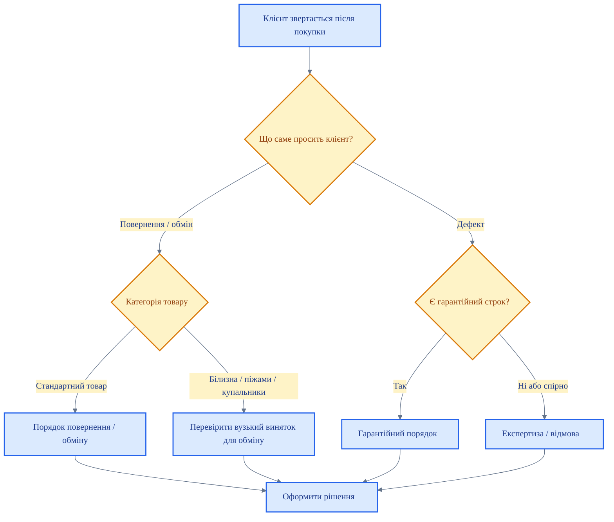

# Повернення та гарантія

<DocumentMeta
  type="regulation"
  status="approved"
  owner="Anton"
  review-cycle-days="365"
  effective-from="2026-03-26"
  last-reviewed="2026-03-26"
/>

> [!NOTE]
> Цей розділ містить документи про повернення, обмін, гарантійні звернення, експертизу та роботу зі спірними випадками після продажу.

## Маршрут звернення клієнта

## Підрозділи

| Розділ | Опис |
|---|---|
| [Повернення](./returns/) | Базовий порядок дій при зверненнях щодо повернення або обміну |
| [Обмін](./exchange/) | Підрозділ для окремих документів щодо обміну |
| [Гарантія](./warranty/) | Гарантійні умови та порядок гарантійного прийняття |
| [Експертиза](./expertise/) | Передача товару на експертизу у спірних випадках |
| [Претензії клієнтів](./customer-claims/) | Робота зі складними клієнтськими зверненнями |
