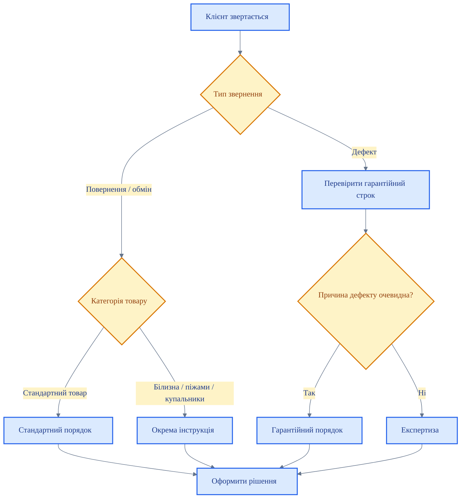

# SOP: Порядок дій при поверненні та обміні товару

<DocumentMeta
  type="sop"
  status="draft"
  owner="Anton"
  review-cycle-days="180"
  effective-from="2026-03-26"
  last-reviewed="2026-03-26"
/>

> [!WARNING]
> Цей документ має статус `draft`. Не є офіційним до підтвердження редактором.

## Мета

Описати базовий порядок дій при зверненні клієнта щодо повернення або обміну товару та не допустити змішування різних типів звернень.

## Коли застосовується

Документ застосовується, якщо клієнт:
- просить повернення коштів;
- просить обмін товару;
- заявляє про дефект;
- не погоджується з можливістю або неможливістю повернення.

## Хто відповідальний

<RoleCard title="Продавець" subtitle="Перша лінія контакту">

- Первинно приймає звернення.
- Збирає інформацію.
- Не дає обіцянок до визначення типу звернення.

</RoleCard>

<RoleCard title="КЗ / адміністратор" subtitle="Маршрутизація звернення">

- Перевіряє підстави.
- Визначає правильний процес: повернення, обмін, гарантія або експертиза.

</RoleCard>

<RoleCard title="Директор магазину" subtitle="Спірні випадки">

- Підключається у складних або конфліктних кейсах.
- Погоджує передачу на експертизу.

</RoleCard>

## Блок-схема маршрутизації звернення

## Покрокові дії

### Крок 1 — Визначте тип звернення

1. Уточніть, чого саме хоче клієнт: повернення, обмін чи розгляд дефекту.
2. Перевірте товар, чек і дату покупки.
3. Не давайте відповідь до визначення типу звернення.

### Крок 2 — Маршрутизуйте звернення

| Тип звернення | Дія |
|---|---|
| Товар належної якості, який підлягає обміну / поверненню | Діяти за стандартним порядком обміну / повернення |
| Натільна білизна / піжами / купальники належної якості | Діяти за окремою інструкцією для персоналу і перевірити, чи є вузький винятковий сценарій для обміну |
| Заява про виробничий дефект у межах строку | Перевести в гарантійний порядок |
| Спір про причину дефекту | Передати на експертизу |

### Крок 3 — Оформіть дію за відповідним сценарієм

- Якщо це стандартний обмін / повернення — оформіть за внутрішнім порядком магазину.
- Якщо це натільна білизна, піжами або купальники належної якості — не змішуйте звернення з гарантією і окремо перевірте, чи підпадає ситуація під вузький виняток для обміну.
- Якщо це гарантія — дійте за SOP гарантійного обслуговування.
- Якщо це спірний дефект — дійте за SOP експертизи.

<EscalationBox title="Ключове правило" level="info">
Продавець не імпровізує і не створює окремі винятки. Спочатку визначається тип звернення, далі застосовується відповідний документ.
</EscalationBox>

## Заборонені дії

- ❌ Обіцяти повернення коштів без перевірки підстав.
- ❌ Змішувати повернення товару належної якості з гарантійним зверненням.
- ❌ Ігнорувати категорію товару і спеціальні обмеження.
- ❌ Передавати клієнту суперечливі формулювання.

## Коли ескалювати

<DecisionRule title="Причина звернення неочевидна" verdict="КЗ / директор" tone="warning">
Не приймайте рішення навмання. Спочатку визначте правильний процес.
</DecisionRule>

<DecisionRule title="Клієнт заявляє про виробничий дефект" verdict="Гарантія" tone="info">
Звернення переводиться в гарантійний порядок, а не вирішується як стандартне повернення.
</DecisionRule>

<DecisionRule title="Є спір щодо причини дефекту" verdict="Експертиза" tone="warning">
Спірний випадок не закривається на рівні продавця.
</DecisionRule>

<DecisionRule title="Клієнт тисне або поводиться агресивно" verdict="Керівник / охорона" tone="warning">
Емоційний конфлікт не ведеться самостійно в торговому залі.
</DecisionRule>

## Пов'язані документи

<RelatedDocuments />
