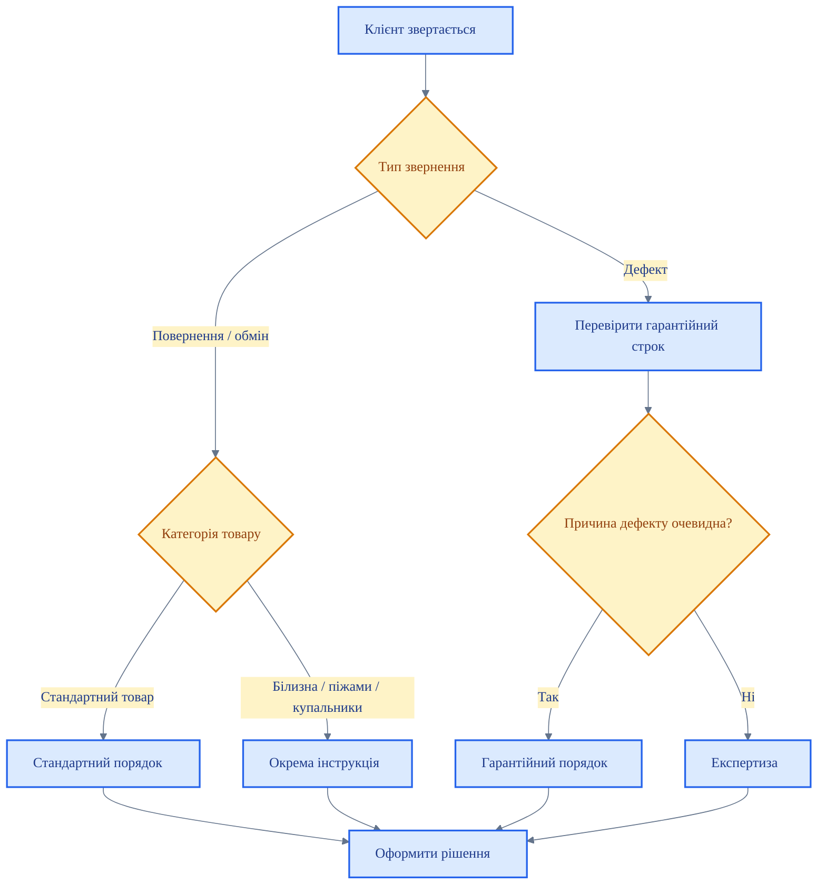

# SOP: Порядок дій при поверненні та обміні товару

  <DocTypeBadge type="sop" />
  <StatusBadge status="draft" />

> [!WARNING]
> Цей документ має статус `draft`. Не є офіційним до підтвердження редактором.

## Мета

Описати базовий порядок дій при зверненні клієнта щодо повернення або обміну товару та не допустити змішування різних типів звернень.

## Коли застосовується

Документ застосовується, якщо клієнт:
- просить повернення коштів;
- просить обмін товару;
- заявляє про дефект;
- не погоджується з можливістю або неможливістю повернення.

## Хто відповідальний

| Роль | Відповідає за |
|---|---|
| Продавець | Первинний прийом звернення, збір інформації, первинну комунікацію |
| КЗ / адміністратор | Перевірку підстав і маршрутизацію звернення |
| Директор магазину | Спірні випадки та передачу на експертизу |

## Блок-схема маршрутизації звернення

## Покрокові дії

### Крок 1 — Визначте тип звернення

1. Уточніть, чого саме хоче клієнт: повернення, обмін чи розгляд дефекту.
2. Перевірте товар, чек і дату покупки.
3. Не давайте відповідь до визначення типу звернення.

### Крок 2 — Маршрутизуйте звернення

| Тип звернення | Дія |
|---|---|
| Товар належної якості, який підлягає обміну / поверненню | Діяти за стандартним порядком обміну / повернення |
| Натільна білизна / піжами / купальники належної якості | Діяти за окремою інструкцією для персоналу і перевірити, чи є вузький винятковий сценарій для обміну |
| Заява про виробничий дефект у межах строку | Перевести в гарантійний порядок |
| Спір про причину дефекту | Передати на експертизу |

### Крок 3 — Оформіть дію за відповідним сценарієм

- Якщо це стандартний обмін / повернення — оформіть за внутрішнім порядком магазину.
- Якщо це натільна білизна, піжами або купальники належної якості — не змішуйте звернення з гарантією і окремо перевірте, чи підпадає ситуація під вузький виняток для обміну.
- Якщо це гарантія — дійте за SOP гарантійного обслуговування.
- Якщо це спірний дефект — дійте за SOP експертизи.

<EscalationBox title="Ключове правило" level="info">
Продавець не імпровізує і не створює окремі винятки. Спочатку визначається тип звернення, далі застосовується відповідний документ.
</EscalationBox>

## Заборонені дії

- ❌ Обіцяти повернення коштів без перевірки підстав.
- ❌ Змішувати повернення товару належної якості з гарантійним зверненням.
- ❌ Ігнорувати категорію товару і спеціальні обмеження.
- ❌ Передавати клієнту суперечливі формулювання.

## Коли ескалювати

- Причина звернення неочевидна → КЗ / директор.
- Клієнт заявляє про виробничий дефект → гарантія.
- Є спір щодо причини дефекту → експертиза.
- Клієнт поводиться агресивно або тисне на персонал → керівник магазину / охорона.

## Пов'язані документи

- [Регламент гарантійних умов](/returns-and-warranty/warranty/reg-warranty-conditions)
- [SOP: Гарантійне обслуговування](/returns-and-warranty/warranty/sop-warranty)
- [SOP: Товарна експертиза](/returns-and-warranty/expertise/sop-expertise)
- [Інструкція: Звернення щодо повернення та обміну натільної білизни](/returns-and-warranty/returns/instruction-underwear-returns-and-exchange)
